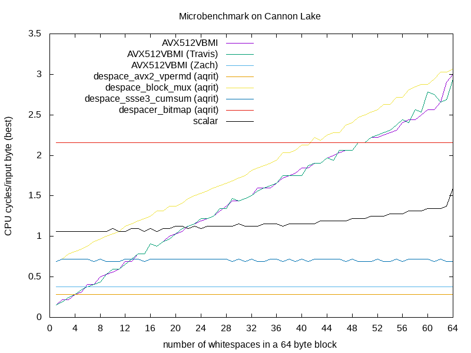

Microbenchmarks
--------------------------------------------------------------------------------

Performance tests
--------------------------------------------------------------------------------

+---------------------+----------------------+----------------------+----------------------+----------------------+-------------------------+---------------------------+------------------------------+-----------------------------+
|        file         |        scalar        |      AVX512VBMI      | AVX512VBMI (Travis)  |  AVX512VBMI (Zach)   | despacer_bitmap (aqrit) | despace_block_mux (aqrit) | despace_ssse3_cumsum (aqrit) | despace_avx2_vpermd (aqrit) |
+---------------------+-----------+----------+-----------+----------+-----------+----------+-----------+----------+-------------+-----------+--------------+------------+---------------+--------------+---------------+-------------+
|                     | time [us] | speed-up | time [us] | speed-up | time [us] | speed-up | time [us] | speed-up |  time [us]  | speed-up  |  time [us]   |  speed-up  |   time [us]   |   speed-up   |   time [us]   |  speed-up   |
+=====================+===========+==========+===========+==========+===========+==========+===========+==========+=============+===========+==============+============+===============+==============+===============+=============+
| tom-sawyer.txt      |       978 |          |       256 |     3.82 |       267 |     3.66 |        39 |    25.08 |         402 |      2.43 |          495 |       1.98 |           142 |         6.89 |            52 |       18.81 |
+---------------------+-----------+----------+-----------+----------+-----------+----------+-----------+----------+-------------+-----------+--------------+------------+---------------+--------------+---------------+-------------+
| census-income.data  |    123950 |          |     45733 |     2.71 |     46847 |     2.65 |     13690 |     9.05 |       98053 |      1.26 |        83003 |       1.49 |         34737 |         3.57 |         14574 |        8.50 |
+---------------------+-----------+----------+-----------+----------+-----------+----------+-----------+----------+-------------+-----------+--------------+------------+---------------+--------------+---------------+-------------+
| weather_sept_85.csv |     74037 |          |     44043 |     1.68 |     44637 |     1.66 |      9866 |     7.50 |       70963 |      1.04 |        66368 |       1.12 |         25113 |         2.95 |         10523 |        7.04 |
+---------------------+-----------+----------+-----------+----------+-----------+----------+-----------+----------+-------------+-----------+--------------+------------+---------------+--------------+---------------+-------------+
| moby-dick.txt       |      2881 |          |       729 |     3.95 |       742 |     3.88 |       118 |    24.42 |        1202 |      2.40 |         1446 |       1.99 |           424 |         6.79 |           156 |       18.47 |
+---------------------+-----------+----------+-----------+----------+-----------+----------+-----------+----------+-------------+-----------+--------------+------------+---------------+--------------+---------------+-------------+
| sherlock.txt        |      1402 |          |       368 |     3.81 |       376 |     3.73 |        55 |    25.49 |         559 |      2.51 |          722 |       1.94 |           198 |         7.08 |            72 |       19.47 |
+---------------------+-----------+----------+-----------+----------+-----------+----------+-----------+----------+-------------+-----------+--------------+------------+---------------+--------------+---------------+-------------+
