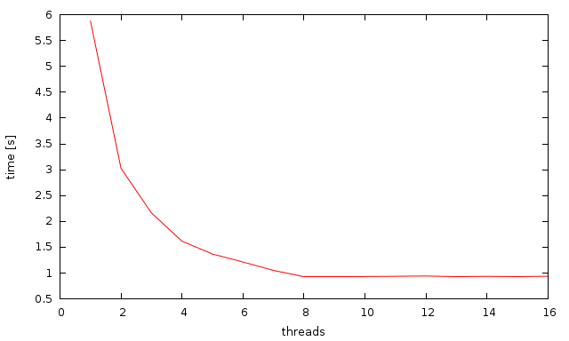

Multithread generator of `Mandelbrot set`__ images.
On system with 2 CPUs speedup is around 1.95 --- 1.99.

__ http://en.wikipedia.org/wiki/Mandelbrot_set

Speedup on some recent CPU (Core i7?):

+---------+----------+-------------+
| threads | time [s] | speedup [%] |
+=========+==========+=============+
| 1       | 5.876    | 100         |
+---------+----------+-------------+
| 2       | 3.028    |  52         |
+---------+----------+-------------+
| 3       | 2.163    |  37         |
+---------+----------+-------------+
| 4       | 1.617    |  28         |
+---------+----------+-------------+
| 5       | 1.369    |  23         |
+---------+----------+-------------+
| 6       | 1.215    |  21         |
+---------+----------+-------------+
| 7       | 1.052    |  18         |
+---------+----------+-------------+
| 8       | 0.934    |  16         |
+---------+----------+-------------+
| 9       | 0.934    |  16         |
+---------+----------+-------------+
| 10      | 0.935    |  16         |
+---------+----------+-------------+
| 11      | 0.940    |  16         |
+---------+----------+-------------+
| 12      | 0.945    |  16         |
+---------+----------+-------------+
| 13      | 0.932    |  16         |
+---------+----------+-------------+
| 14      | 0.938    |  16         |
+---------+----------+-------------+
| 15      | 0.932    |  16         |
+---------+----------+-------------+
| 16      | 0.941    |  16         |
+---------+----------+-------------+

