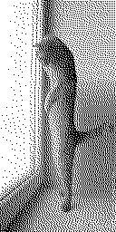

Introduction
========================================================================

This simple program display b/w image (128x256 pixels)
on Linux terminal run on EGA/VGA video card.

It is just a proof of concept, so everything is hardwired
in the code.

What this program do?

- splits image into 256 pieces (8x16 pixels) and set them
  as console font (ioctl PIO_FONTX)
- switches console into utf-8 mode, and then print
  all characters from 0-256 (16x16); unicode characters
  U+F000 - U+F1FF gives direct access to loaded font
  (``showcfont`` also uses this method)

The main problem
========================================================================

EGA/VGA cards use fonts of width 8 pixels, but by default
cell grid has width 9 pixels.  For most characters 9th column
is blank, but for characters 0xC0-0xDF 9th column is a copy
of first one (line-drawing characters are placed somewhere
in that range). Because of that displayed image is not
consistent -- text mode were designed to display characters,
not graphics.

But if you have a root login and pass parameter 'root', then
program will try to reprogram EGA/VGA card in order to get
real 8-pixels with characters -- it is absolutely safe for
your hardware.

Compilation
========================================================================

::

	gcc -O2 view_img.c -o view_img

Program uses setterm utility.

