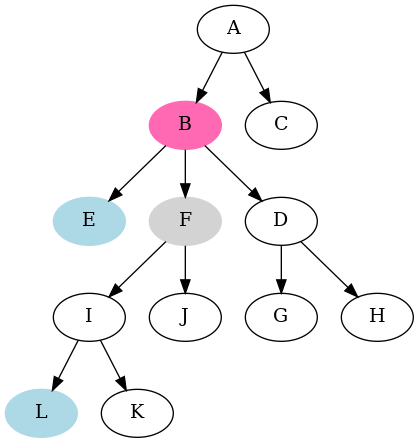

================================================================================
    Finding lowest common ancestor of two nodes
================================================================================

Author: Wojciech Muła

Last update: 2021-11-26

Introduction
-------------------------------------------------------------------------------

There are several approaches to finding `lowest common ancestor`__ (LCA).

__ https://en.wikipedia.org/wiki/Lowest_common_ancestor

The algorithm showed here does not need extra memory.  There's an assumption
that we can get the parent node of given node in constant time.

Algorithm
-------------------------------------------------------------------------------

The main idea is to first move node pointers to **the same depth**. When
the nodes are at the same level, then finding their LCA requires just moving
both pointers upwards until they meet.

For instance if we want to find LCM of nodes **L** and **E**, we first
move pointer to L until it reaches level of **E** --- it's node **F**.
Then we move both pointers upwards and they meet at **B** which is LCM(L, E).

Algorithm::

    function LCM(node1, node2)
    begin
            -- part 1
         1. d1 = depth(node1)
         2. d2 = depth(node2)

         3. if d1 > d2 then
         4.     for i := 0 to d1 - d2 loop
         5.         node1 = parent(node1)
         6.     endloop
         7. else if d2 > d1 then
         8.     for i := 0 to d2 - d1 loop
         9.         node1 = parent(node1)
        10.     endloop
        11. endif

            -- part 2
        12. while node1 != node2 loop
        13.     node1 = parent(node1)
        14.     node2 = parent(node2)
        15. endloop

        16. return node1
    end

    function depth(node)
    begin
        n := 0
        while node loop
            node = parent(node)
            n += 1
        endloop

        return n
    end

Time analysis
-------------------------------------------------------------------------------

Let **h** be maximum depth of the input nodes.

To find node's depth we need to traverse the tree from the node to the root;
it's done twice (lines 1 and 2).

Then we move one of node pointers up in the tree (lines 3-11). The maximum
number of iterations in the for loops (lines 4-6 and lines 8-19) equals to
**h**.

The final while-loop (lines 12-15) also may iterate up to **h** times.

Thus the asymptotic comlexity is ``O(h)``.

The exact numbers of ``parent`` invocations:

- Best case  --- one of nodes is the root:
    - line 1: ``h``,
    - line 2: ``0``,
    - lines 4-6: ``h``,
    - lines 8-10: ``0``,
    - lines 12-15: ``0``,
    - total: ``2*h``.
- Worst case --- the LCA of nodes is the root; assume their depths is the same:
    - line 1: ``h``,
    - line 2: ``h``,
    - lines 4-6: ``0``,
    - lines 8-10: ``0``,
    - lines 12-15: ``2 * h``,
    - total: ``4*h``.
