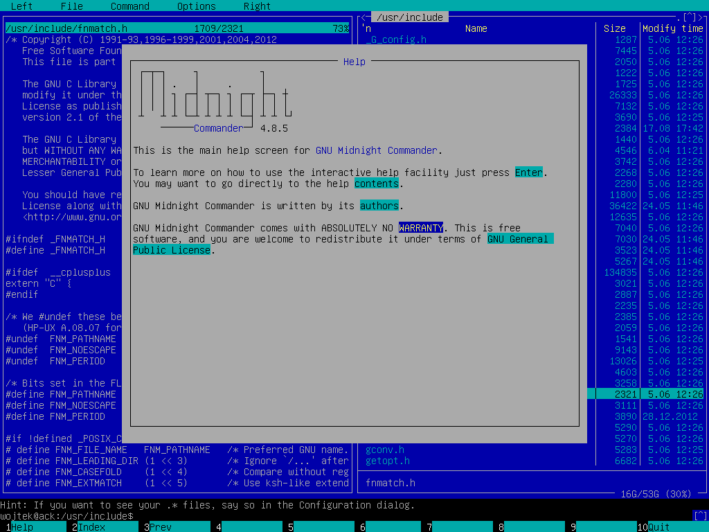
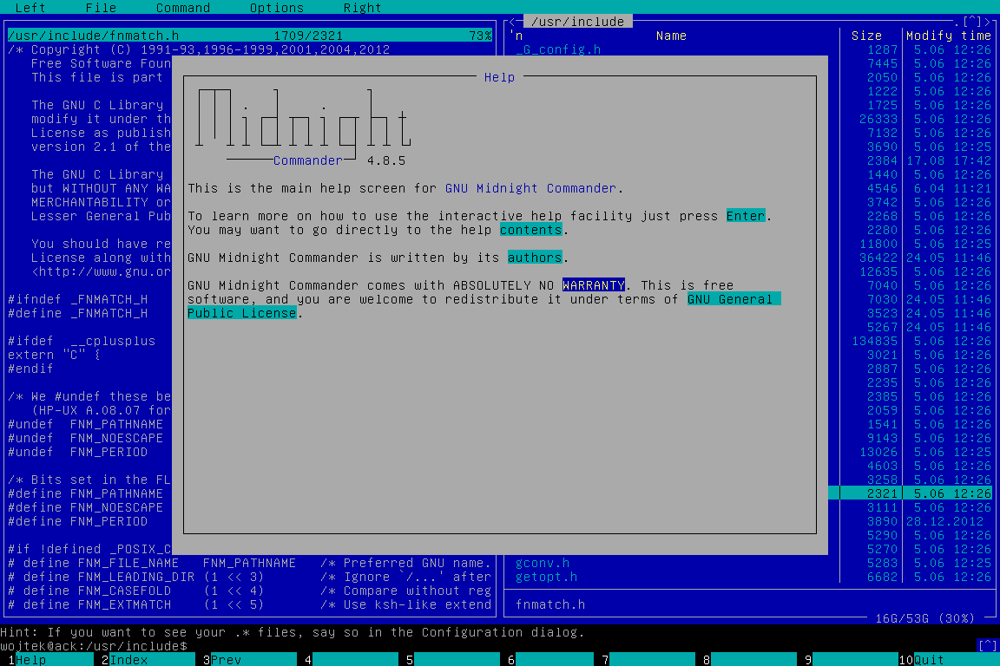

========================================================================
                          TTY screenshot
========================================================================

This simple utility allows to export content of linux console
to PNM file. Current font and colors are preserved.

VGA card is able to render fonts of 8 or 9 pixeles width, in 9-pixels
mode in some line-drawing characters 9-th column of pixels is copy of
8-th. In ``ttyscreenshot`` it's possible to select rendering mode.

Compilation::

	gcc -O2 ttyscreenshot.c -o ttyscreenshot

Examples
------------------------------------------------------------------------

.. image:: alsa.png

